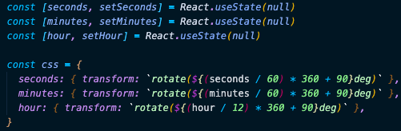

# Portfolio

This is a basic markdown blog built with Gatsby.js. It uses React components styled with CSS Styled-Components & uses graphQL to query for markdown files within a local directory.

## Technologies Used:

> - Gatsby.js
> - React.js
> - JavaScript
> - CSS Components

## Features & Functions

### Clock

> - Create Clocks component
>   - render Clock components
>   - pass down as props to Clock components the name of a city
> - 
> - Create Clock component
>   - create state for seconds, minutes & hour
>   - create css object that I will pass to the hands of the clock
> - 
>   - create functions to get the current seconds, minutes & hour
>     - calculate time difference for the hour for each city
> - 
>   - call all three functions inside of a useEffect hook to get the time when the component first loads
>   - pass the css variables to the hands as inline styling
> - 

## Source

> Alex Merced Create-markdown-blog: https://tuts.alexmercedcoder.com/2020/gatsbyportfolio/
>
> Wes Bos JavaScript30: https://javascript30.com/

## Contact

> - [LinkedIn](https://www.linkedin.com/in/benjamin-alt-higginbotham/)
> - [Portfolio](https://higginbotham.fun/)
> - [Tweet @BenMichaelJord1](https://twitter.com/BenMichaelJord1)
