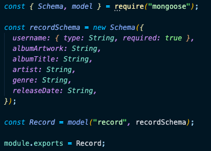

---

This is a Full Stack application to post your record collection. It's built with the Mongo(DB/ose), Express, React & Node (MERN) stack. It has two full CRUD features, a user account & a record profile. It is styled with Bootstrap, featuring a mobile-first design. Lastly, you can play the drums with your keyboard and I hope you think it's as cool as I do.

> ### Git Url:
>
> https://github.com/bicycleben88/higginbotham-records

## Technologies Used:

> - Node.js
> - React
> - Express
> - MongoDB
> - Mongoose
> - CSS Bootstrap
> - BCrypt

## Features & Functions

> - Models, Views, Controllers (MVC) pattern
>   - Models define the data of a piece of content (e.g. a record),
>   - 
>   - Controllers
>     - define the routes associated with particular model
>     - follow RESTful\* convention (i.e. HTTP verb + endpoint = specific piece of data)
>   - 
>   - Views
>     - are returned by a controller
>     - make up the front end of the user interface
>     - written in .jsx as React components
>   - 
> - Drum Kit
>   - import router & tell server to use it when it recieves a request from "https:...../drum"
>   - 
>   - define get route in controller to return drum.jsx from views folder
>   - Views
>     - use custom data-key attribute to associate a keyboard key with an audio file
>   - 
>   - import app.js in \<Layout> to make it avaiable to all components
>   - JavaScript Logic
>     - Grab DOM elements & add event listeners
>     - 
>     - playAudio()
>       - grab the audio file associated with the keyboard key that triggered the event
>       - if there's an audio file, then play the audio file from the beggining
>     - 
>     - removeClass() removes css effect
>       

## Notes

> - RESTful - “Representational State Transfer”. It is a set of rules that developers follow when they create their API. One of these rules states that you should be able to get a piece of data (called a resource) when you link to a specific URL

## Contact

> - [LinkedIn](https://www.linkedin.com/in/benjamin-alt-higginbotham/)
> - [Tweet @BenMichaelJord1](https://twitter.com/BenMichaelJord1)
